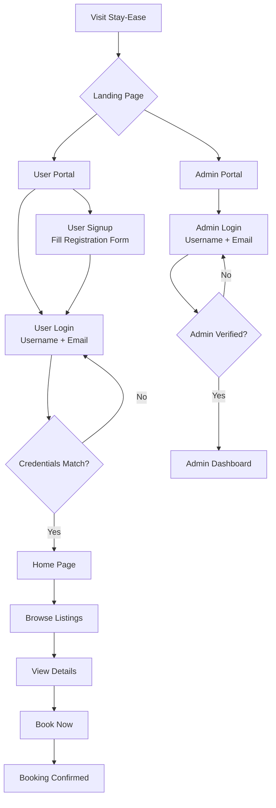
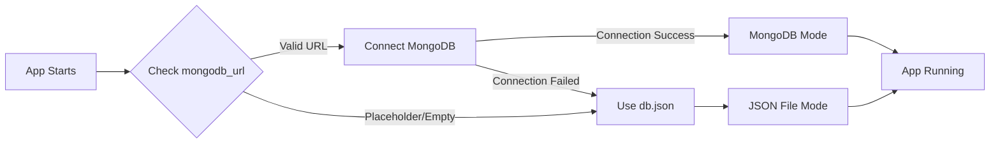

<div align="center">

<!-- Animated SVG Banner -->
<svg width="900" height="200" xmlns="http://www.w3.org/2000/svg">
  <defs>
    <linearGradient id="bg" x1="0%" y1="0%" x2="100%" y2="100%">
      <stop offset="0%" style="stop-color:#1a1f36">
        <animate attributeName="stop-color" values="#1a1f36;#242b4d;#0e1222;#1a1f36" dur="10s" repeatCount="indefinite"/>
      </stop>
      <stop offset="50%" style="stop-color:#2d3561">
        <animate attributeName="stop-color" values="#2d3561;#3c467a;#1b213b;#2d3561" dur="10s" repeatCount="indefinite"/>
      </stop>
      <stop offset="100%" style="stop-color:#0abf8a">
        <animate attributeName="stop-color" values="#0abf8a;#06d6a0;#059669;#0abf8a" dur="10s" repeatCount="indefinite"/>
      </stop>
    </linearGradient>
    <filter id="glow" x="-20%" y="-20%" width="140%" height="140%">
      <feGaussianBlur stdDeviation="4" result="blur"/>
      <feComposite in="SourceGraphic" in2="blur" operator="over"/>
    </filter>
  </defs>
  <!-- Background -->
  <rect width="900" height="200" rx="18" fill="url(#bg)"/>
  
  <!-- Animated floating circles (decorative) -->
  <circle cx="820" cy="40" r="60" fill="#f5a623" opacity="0.06">
    <animate attributeName="r" values="60;75;60" dur="4s" repeatCount="indefinite"/>
    <animate attributeName="cy" values="40;55;40" dur="8s" repeatCount="indefinite"/>
  </circle>
  <circle cx="100" cy="170" r="50" fill="#0abf8a" opacity="0.08">
    <animate attributeName="r" values="50;65;50" dur="3s" repeatCount="indefinite"/>
    <animate attributeName="cx" values="100;120;100" dur="6s" repeatCount="indefinite"/>
  </circle>
  <circle cx="500" cy="180" r="40" fill="#2d3561" opacity="0.3">
    <animate attributeName="r" values="40;55;40" dur="5s" repeatCount="indefinite"/>
  </circle>
  
  <!-- Hotel icon (SVG path) on the left -->
  <g transform="translate(60, 50)" fill="none" stroke-width="2.5" stroke-linecap="round" stroke-linejoin="round">
    <path d="M4 36h32M8 36V12a3 3 0 0 1 3-3h18a3 3 0 0 1 3 3v24" stroke="#0abf8a">
      <animate attributeName="stroke" values="#0abf8a;#f5a623;#0abf8a" dur="6s" repeatCount="indefinite"/>
    </path>
    <path d="M16 36V26a2 2 0 0 1 2-2h4a2 2 0 0 1 2 2v10" stroke="#f5a623">
      <animate attributeName="stroke" values="#f5a623;#0abf8a;#f5a623" dur="6s" repeatCount="indefinite"/>
    </path>
    <rect x="12" y="14" width="4" height="4" rx="1" fill="#fff" opacity="0.8">
      <animate attributeName="opacity" values="0.3;1;0.3" dur="3s" repeatCount="indefinite"/>
    </rect>
    <rect x="24" y="14" width="4" height="4" rx="1" fill="#fff" opacity="0.8">
      <animate attributeName="opacity" values="1;0.3;1" dur="3s" repeatCount="indefinite"/>
    </rect>
    <rect x="12" y="20" width="4" height="4" rx="1" fill="#fff" opacity="0.8">
      <animate attributeName="opacity" values="0.5;1;0.5" dur="2.5s" repeatCount="indefinite"/>
    </rect>
    <rect x="24" y="20" width="4" height="4" rx="1" fill="#fff" opacity="0.8">
      <animate attributeName="opacity" values="1;0.5;1" dur="2.5s" repeatCount="indefinite"/>
    </rect>
    <path d="M20 3l1 2h2l-1.5 1.5 0.5 2-2-1.2-2 1.2 0.5-2L17 5h2z" fill="#f5a623">
      <animate attributeName="opacity" values="0.2;1;0.2" dur="2s" repeatCount="indefinite"/>
    </path>
  </g>
  
  <!-- Resort palm tree icon on the right -->
  <g transform="translate(800, 50)" fill="none" stroke-width="2.5" stroke-linecap="round" stroke-linejoin="round">
    <path d="M2 36c10-2 20-2 28 0" stroke="#0abf8a">
      <animate attributeName="stroke" values="#0abf8a;#f5a623;#0abf8a" dur="6s" repeatCount="indefinite"/>
    </path>
    <path d="M16 36c-2-6-1-14 3-20" stroke="#f5a623">
      <animate attributeName="stroke" values="#f5a623;#0abf8a;#f5a623" dur="6s" repeatCount="indefinite"/>
    </path>
    <path d="M19 16c2-4 7-6 10-4M19 16c-3-3-7-4-10-1M19 16c3 1 7 4 8 8M19 16c-1 3-3 7-6 9" stroke="#fff" opacity="0.9">
      <animate attributeName="opacity" values="0.6;1;0.6" dur="4s" repeatCount="indefinite"/>
    </path>
  </g>
  
  <!-- Main Title: Stay-Ease -->
  <text x="450" y="95" 
        font-family="Georgia,serif" 
        font-size="52" 
        font-weight="bold" 
        fill="white" 
        text-anchor="middle"
        letter-spacing="3"
        filter="url(#glow)">
    Stay-Ease
    <animate attributeName="opacity" values="0;1" dur="1.5s" fill="freeze"/>
  </text>
  
  <!-- Tagline -->
  <text x="450" y="140" 
        font-family="Arial,sans-serif" 
        font-size="18" 
        fill="#f5a623" 
        text-anchor="middle"
        letter-spacing="1">
    Your Perfect Stay, Simplified
    <animate attributeName="opacity" values="0;1" dur="2s" fill="freeze"/>
  </text>
  
  <!-- Animated underline -->
  <line x1="300" y1="155" x2="600" y2="155" 
        stroke="#0abf8a" stroke-width="2" opacity="0.7">
    <animate attributeName="x1" values="450;300" dur="1s" fill="freeze"/>
    <animate attributeName="x2" values="450;600" dur="1s" fill="freeze"/>
  </line>
</svg>

<!-- Typing SVG Badge -->


</div>

<br/>

<div align="center">

<!-- Tech Stack Badges -->


<!-- Status Badges -->


</div>

---

<div align="center">

### Application Preview

| Home Page | Hotel Listings |
|:---:|:---:|
|  |  |

| Lodge Listings | Rental Properties |
|:---:|:---:|
|  |  |

</div>

---

## Table of Contents

| # | Section |
|---|---------|
| 1 | [Features](#features) |
| 2 | [Application Preview](#application-preview) |
| 3 | [Tech Stack](#tech-stack) |
| 4 | [Project Structure](#project-structure) |
| 5 | [Quick Start](#quick-start) |
| 6 | [Authentication](#authentication) |
| 7 | [Database](#database) |
| 8 | [API Routes](#api-routes) |
| 9 | [Project Stats](#project-stats) |
| 10 | [Property Categories](#property-categories) |
| 11 | [UI Highlights](#ui-highlights) |
| 12 | [Contributing](#contributing) |
| 13 | [License](#license) |

---

## Features

<div align="center">

### What Makes Stay-Ease Special

</div>

### User Features
| Feature | Description |
|---------|-------------|
| **Passwordless Login** | Sign in securely and instantly with just username + email matching. |
| **Browse Listings** | Explore properties under three rich categories: Hotels, Lodges & Rentals. |
| **Smart Filters** | Search and filter listings by name, category, location, and rating. |
| **View Details** | Detailed property view showing full galleries, amenities list, contact details, and description. |
| **Book Now** | Complete bookings using an interactive modal form with date pickers. |
| **Price Calculator** | Real-time calculations of subtotal, 18% GST tax, and net payable amount. |
| **My Bookings** | Track, review, and cancel active reservations in real-time. |
| **Profile Management** | Edit details (Avatar, Phone, Gender, Date of Birth, City) with live uploads. |

### Admin Features
| Feature | Description |
|---------|-------------|
| **Dashboard Stats** | Real-time totals, active inventory counts, and user/booking metrics on load. |
| **Manage Listings** | Complete CRUD operations for properties with inline base64 image previews. |
| **Manage Users** | Activate/deactivate accounts or delete user profiles directly. |
| **Manage Bookings** | Live lifecycle controls: change status (Pending/Confirmed/Cancelled) or delete bookings. |
| **Revenue Tracking** | Compute overall and monthly revenue totals dynamically. |
| **Export CSV** | Download formatted booking lists as CSV spreadsheets with one click. |
| **Image Upload** | Drag & drop file selector encoding uploads into base64 data URIs. |
| **Search & Filter** | Advanced search filters across users, listings, and bookings. |

---

## Tech Stack

<div align="center">

| Layer | Technology | Purpose |
|:---:|:---:|:---:|
| **Runtime** |  | Lightweight, fast asynchronous backend server |
| **Framework** |  | Web server routing and application logic |
| **Templates** |  | Server-side template rendering for dynamic HTML UI |
| **Database** |  | Persistent Cloud document database (Mongoose ODM) |
| **Fallback DB** |  | Automatic file fallback storage (`db.json`) for configuration-free local execution |
| **Auth** |  | Secure cookie-based stateful authentication sessions |
| **Styling** |  | Beautiful Glassmorphism stylesheet utilizing HSL variables and flex/grid |
| **Images** |  | Modern high-definition property illustrations |

</div>

---

## Project Structure

A clean, modular directory structure containing models, middleware, controllers, public styles, and server logic:

```text
Stay-Ease/
│
├── middleware/
│   ├── isAdminLoggedIn.js  # Restricts routes to active admin sessions
│   └── isUserLoggedIn.js   # Restricts routes to active user sessions
│
├── models/
│   ├── Admin.js            # Admin profiles (FullName, Username, Email, Phone, Bio, etc.)
│   ├── Booking.js          # Booking entries (BookingId, Stay duration, guest details, pricing)
│   ├── Listing.js          # Accommodation entries (Name, Location, Category, Price, Amenities, Image)
│   └── User.js             # User accounts (FullName, Username, Email, City, Status)
│
├── public/
│   ├── css/
│   │   ├── admin.css       # Layout styles for the administrative panel
│   │   ├── auth.css        # Centered visual inputs for user & admin login/signup
│   │   ├── booking.css     # Styling for booking form cards and details
│   │   ├── detail.css      # Property overview gallery, descriptions, and rules
│   │   ├── global.css      # Core HSL variable design system, buttons, & resets
│   │   ├── home.css        # Search, hero category selectors, and listing grids
│   │   ├── landing.css     # Clean visual gateway layout (Role Selector)
│   │   ├── listings.css    # Grid views for listing cards (hover lift & shadows)
│   │   └── profile.css     # Form layouts for profile editing and avatar cropping
│   │
│   ├── js/
│   │   └── admin.js        # Dynamic front-end logic for Single Page Admin Panel
│   └── hotel_background.png # Premium background asset for authentication
│
├── src/
│   ├── dbService.js         # Unified CRUD adapter matching MongoDB API / JSON fallback
│   └── db.json            # Dynamic fallback database populated in absence of MongoDB URL
│
├── views/                  # Embedded Javascript (EJS) markup templates
│   ├── adminDashboard.ejs  # Control dashboard (Single-page app for Listings, Users, Bookings)
│   ├── adminLogin.ejs      # Login form layout for administrators
│   ├── adminSignup.ejs     # Sign up form layout for administrators
│   ├── home.ejs            # Main landing search page for authenticated users
│   ├── hotels.ejs          # Grid listings filter targeting Hotels category
│   ├── landing.ejs         # Application entry portal for selecting portals
│   ├── listingDetail.ejs   # Individual accommodation view page with image gallery
│   ├── lodges.ejs          # Grid listings filter targeting Lodges category
│   ├── myBookings.ejs      # Active & cancelled bookings list of a logged-in user
│   ├── rentals.ejs         # Grid listings filter targeting Rentals category
│   ├── userLogin.ejs       # Passwordless portal entry for users
│   ├── userProfile.ejs     # Profile management form layout
│   └── userSignup.ejs      # User registration form layout
│
├── .env                     # App configuration parameters
├── index.js                 # Unified entry point initializing routes & DB connections
└── package.json             # Project dependencies and deployment runner
```

---

## Quick Start

Follow these steps to set up and run Stay-Ease locally on your computer:

### Prerequisites


### 1 Clone the Repository

```bash
git clone https://github.com/yourusername/stay-ease.git
cd stay-ease
```

### 2 Install Dependencies

```bash
npm install
```

### 3 Configure Environment

Create a `.env` file in the root directory:

```env
# MongoDB Connection URL (optional)
# Leave blank or set to a placeholder containing "xxxxx" to use local file db
mongodb_url = mongodb+srv://<username>:<password>@cluster0.mongodb.net/

# Session Secret (Required)
SESSION_SECRET = stayease-session-secret-key-2026

# Port (Optional, defaults to 5050 if unset)
PORT = 5050
```

> **Tip:** If `mongodb_url` is left blank, empty, or contains `xxxxx`, the app automatically switches to the local `src/db.json` database. No MongoDB setup is required for testing!

### 4 Start the Application

```bash
node index.js
```

### 5 Open in Browser

Depending on the configuration in `.env` (defaulting to Port `5050`), visit these URLs:

| Portal | URL |
|--------|-----|
| Landing Page | [http://localhost:5050/](http://localhost:5050/) |
| Home Page | [http://localhost:5050/home](http://localhost:5050/home) |
| Hotels Grid | [http://localhost:5050/hotels](http://localhost:5050/hotels) |
| Lodges Grid | [http://localhost:5050/lodges](http://localhost:5050/lodges) |
| Rentals Grid | [http://localhost:5050/rentals](http://localhost:5050/rentals) |
| Admin Login | [http://localhost:5050/admin/login](http://localhost:5050/admin/login) |
| User Login | [http://localhost:5050/user/login](http://localhost:5050/user/login) |

---

## Authentication



### Default Credentials

A default administrator is auto-seeded in the database for instant verification:

| Role | Username | Email | Access Level |
|------|----------|-------|--------------|
| **Admin** | `admin` | `admin@stayease.com` | Access to control statistics, listing updates, user toggle, and bookings CSV downloads |

> **Security Note:** Login utilizes username + email matching. Administrative actions are fully protected via middleware. To add secondary administrators, visit the hidden signup portal at `/admin/signup` with the secret code: `STAYEASE_ADMIN_2025`.

---

## API Routes

### Public Routes
| Method | Route | Description |
|--------|-------|-------------|
| `GET` | `/` | Portal gateway (Role Selector landing screen) |
| `GET` | `/user/login` | User login form page |
| `GET` | `/user/signup` | User signup form page |
| `POST` | `/user/login` | Validates user session credentials |
| `POST` | `/user/signup` | Adds user record and redirects to login |
| `GET` | `/admin/login` | Administrative login page |
| `POST` | `/admin/login` | Validates admin session credentials |
| `GET` | `/admin/signup` | Hidden admin registration page |
| `POST` | `/admin/signup` | Registers new administrator using access key |

### Protected User Routes
| Method | Route | Description |
|--------|-------|-------------|
| `GET` | `/home` | Main home page showing active listings & search bar |
| `GET` | `/hotels` | Redirects to category filtered Hotel listings page |
| `GET` | `/lodges` | Redirects to category filtered Lodge listings page |
| `GET` | `/rentals` | Redirects to category filtered Rental listings page |
| `GET` | `/home/hotel` | View Hotel grid listings |
| `GET` | `/home/lodges` | View Lodge grid listings |
| `GET` | `/home/rentals` | View Rental grid listings |
| `GET` | `/listing/:id` | View specific property description, gallery & contact detail |
| `POST` | `/booking/create` | Creates a property booking reservation |
| `GET` | `/my-bookings` | Lists active and cancelled bookings |
| `POST` | `/booking/cancel/:id` | Set status of own booking to "Cancelled" |
| `GET` | `/profile` | Displays profile update page |
| `POST` | `/profile` | Updates user details & avatar |
| `POST` | `/user/logout` | Clears user cookie session |

### Admin Routes and AJAX APIs
| Method | Route | Description |
|--------|-------|-------------|
| `GET` | `/admin/dashboard` | Main dashboard control layout |
| `GET` | `/admin/listings` | Administrative listing subpanel EJS view |
| `GET` | `/admin/users` | Administrative user management subpanel EJS view |
| `GET` | `/admin/bookings` | Administrative booking management subpanel EJS view |
| `GET` | `/admin/profile` | Administrative profile manager subpanel EJS view |
| `GET` | `/api/listings` | Fetch all properties (JSON) |
| `GET` | `/api/listings/:id` | Fetch specific property details (JSON) |
| `POST` | `/api/listings` | Create a new property listing (JSON) |
| `PUT` | `/api/listings/:id` | Update property listing information (JSON) |
| `DELETE` | `/api/listings/:id` | Remove a property listing (JSON) |
| `GET` | `/api/admin/bookings` | Fetch all active bookings (JSON) |
| `POST` | `/admin/booking/status/:id` | Change status of any booking |
| `POST` | `/admin/booking/delete/:id` | Remove booking from database |
| `GET` | `/api/admin/bookings/export` | Export bookings list as CSV |
| `GET` | `/api/admin/users` | Fetch registered user list (JSON) |
| `PUT` | `/api/admin/users/:id/toggle` | Toggle user active / suspended status |
| `DELETE` | `/api/admin/users/:id` | Permanently remove user record |
| `POST` | `/admin/logout` | Clears administrative cookie session |

---

## Database

### Dual-Mode Storage Architecture

The application has a hybrid database system that runs out-of-the-box using either **MongoDB** or a **JSON local file** fallback, managed by [dbService.js](file:///c:/Users/rimid/OneDrive/Desktop/Stay%20Ease/src/dbService.js):



### Data Models Overview

<details>
<summary>Listing Schema (models/Listing.js)</summary>

```json
{
  "name": "The Grand Imperial",
  "category": "Hotel",
  "location": "Mumbai, Maharashtra",
  "price": 8500,
  "description": "Luxurious 5-star hotel featuring an infinity pool, dynamic dining, and spa facilities.",
  "amenities": ["WiFi", "AC", "Pool", "Parking", "Breakfast"],
  "rating": 5,
  "available": true,
  "contact": "9876543210",
  "image": "data:image/png;base64,iVBORw0KGgo...",
  "image2": "",
  "image3": "",
  "image4": "",
  "createdAt": "2026-06-29T08:00:00.000Z"
}
```
</details>

<details>
<summary>User Schema (models/User.js)</summary>

```json
{
  "fullName": "Rimi Dutta",
  "username": "rimi_dutta",
  "email": "rimi@example.com",
  "phone": "9876543210",
  "gender": "Female",
  "dateOfBirth": "1998-05-15T00:00:00.000Z",
  "city": "Shimla",
  "avatar": "data:image/jpeg;base64,/9j/4AAQSkZJRg...",
  "isActive": true,
  "createdAt": "2026-06-29T08:15:00.000Z",
  "lastLogin": "2026-06-29T08:45:00.000Z"
}
```
</details>

<details>
<summary>Booking Schema (models/Booking.js)</summary>

```json
{
  "bookingId": "SE-2026-4821",
  "listingId": "65b5c907a9e0f6b15865e239",
  "listingName": "The Grand Imperial",
  "category": "Hotel",
  "location": "Mumbai, Maharashtra",
  "listingImage": "data:image/png;base64,iVBORw0KGgo...",
  "guestName": "Rimi Dutta",
  "guestEmail": "rimi@example.com",
  "guestPhone": "9876543210",
  "userId": "65b5c907a9e0f6b15865e230",
  "checkIn": "2026-07-15T00:00:00.000Z",
  "checkOut": "2026-07-17T00:00:00.000Z",
  "nights": 2,
  "guests": 2,
  "roomType": "Deluxe",
  "pricePerNight": 8500,
  "subtotal": 17000,
  "tax": 3060,
  "totalAmount": 20060,
  "paymentMethod": "Pay at Property",
  "specialRequests": "Late check-in requested",
  "status": "Confirmed",
  "createdAt": "2026-06-29T08:48:00.000Z"
}
```
</details>

---

## Project Stats

<div align="center">

<!-- Animated stat cards using shields.io -->


</div>

---

## Property Categories

<div align="center">

### Hotels
*Luxury stays with world-class amenities*


---

### Lodges
*Cozy mountain retreats close to nature*


---

### Rentals
*Private homes and villas for a personal touch*


</div>

---

## UI Highlights

| Feature | Details |
|---------|---------|
| **Design Style** | Premium Glassmorphism overlay + modern flat layout grids |
| **Color Palette** | Navy `#1a1f36` (Dominant) • Gold `#f5a623` (Accents) • Teal `#0abf8a` (Highlights) |
| **Typography** | Playfair Display (Serif headings) + Inter (Clean sans-serif reading text) |
| **Animations** | Responsive micro-interactions, springy hover card lifts, and smooth page fades |
| **Responsive** | Dynamic media queries tailoring components for Mobile, Tablet, and Desktop screen widths |
| **Admin Theme** | Deep navy sidebar configuration paired with a high-contrast clean content workspace |
| **Cards** | Subtle shadow elevation offsets matched with scale-based image zooms on hover |
| **Toasts** | Auto-dismissing success, deactivation warnings, and database connection notifications |

---

## Contributing

We welcome contributions to Stay-Ease! To contribute, follow these guidelines:

1. **Fork the Repository** on GitHub.
2. **Create a Feature Branch**:
   ```bash
   git checkout -b feature/AmazingFeature
   ```
3. **Commit Your Changes** with descriptive comments:
   ```bash
   git commit -m "Add some AmazingFeature"
   ```
4. **Push to the Branch**:
   ```bash
   git push origin feature/AmazingFeature
   ```
5. **Open a Pull Request** explaining your implementation details.

### Found a Bug?
Create a new GitHub Issue using the `bug` label. Please describe:
- What happened (unexpected behavior details).
- What you expected to happen.
- Steps to reproduce the issue.

---

## License

This project is licensed under the terms of the **MIT License**. Feel free to use, modify, and distribute it in accordance with the license.
